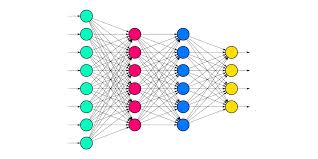
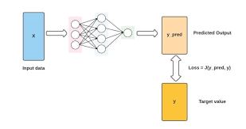
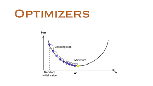

# 1st-Neural-Network-
# Dense 
``` 
A layer where each neuron is connected to every neuron in the previous layer
```

### Example



from tensorflow.keras.models import Sequential
from tensorflow.keras.layers import Dense

```python
model = Sequential([
    Dense(10, input_shape=(5,), activation='relu')  # 10 neurons, input shape of 5 features
])
```
 ## Loss
 ``` 
 Measures how good a neural network model is in performing a certain task
 It calculates the difference between the predicted output and the actual output. The goal of training a neural network is to minimize this loss
 ```
### Example

 

## Common Loss Functions:

- **Mean Squared Error (MSE)**: Used for regression tasks.
- **Categorical Crossentropy**: Used for classification tasks

```python 
from tensorflow.keras.losses import MeanSquaredError

loss_fn = MeanSquaredError()
```

## Optimizer
 ```
Find minmum values of functins A function or an algorithm that adjusts the attributes of the neural network, such as weights and learning rates
 An optimizer adjusts the weights of the neurons in the neural network to minimize the loss. 
 ```

 ## Common Optimizers:

- SGD (Stochastic Gradient Descent):
- Adam:
- RMSprop:

```python
from tensorflow.keras.optimizers import Adam
optimizer = Adam(learning_rate=0.001)

```

